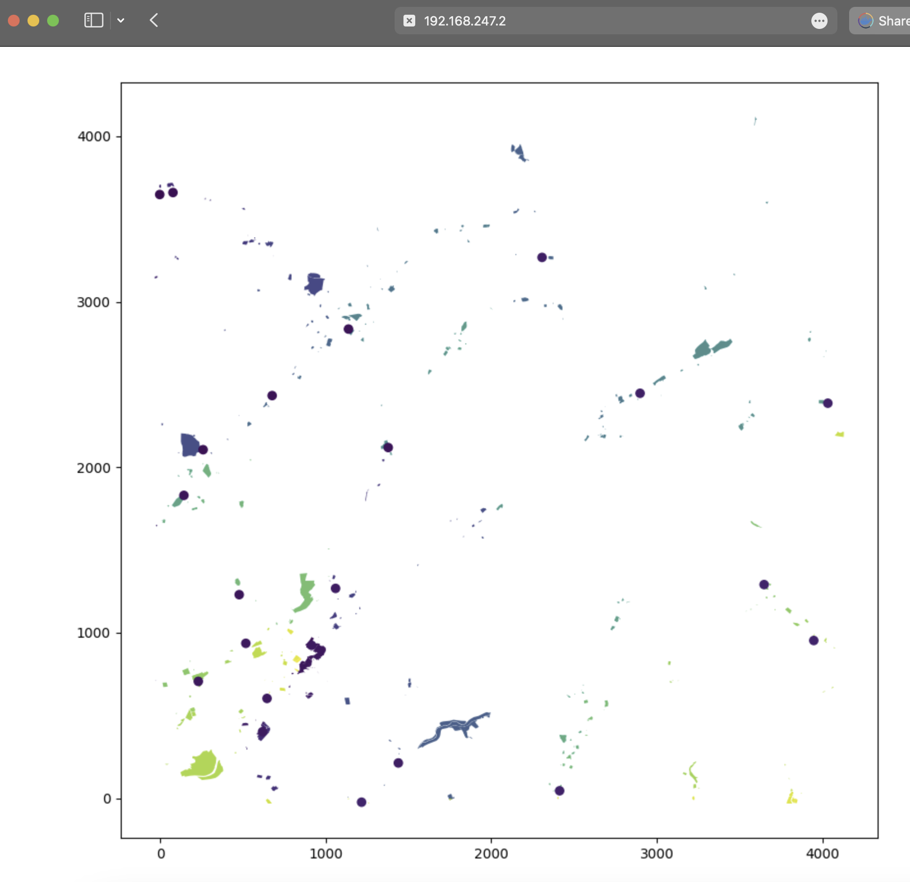

# GIS in Python

A brief description of your project.

## Table of Contents

- [Installation](#installation)
- [Usage](#usage)

## Installation

Build the image and container in detached mode:
```
docker-compose up --build -d
```
The flask app is now running at the following:
```
http://127.0.0.1:5000/tile?zoom=10&col=501&row=684
```

## Usage

#### Endpoint:

```
  GET /tile?zoom=10&col=501&row=684
```

| Parameter | Type     | Description                |
| :-------- | :------- | :------------------------- |
| `zoom` | `int` | **Required**. |
|  `col` | `int` | **Required**       | 
|  `row` | `int` | **Required**       |    

Here we have three values. The zoom, column and row. These values can be used to bring the tile of your choice. A simple map is then plot in the browser.


#### Unit Tests:
You can run the unit tests by the following command. The unit tests are also invoked when the docker image is being created. If the tests fail, the image and container won't be created/updated.

```
python -m unittest tests.py
```
In case you want to run the unittest inside the container:

```
docker exec -it flask python -m unittest tests.py
```


